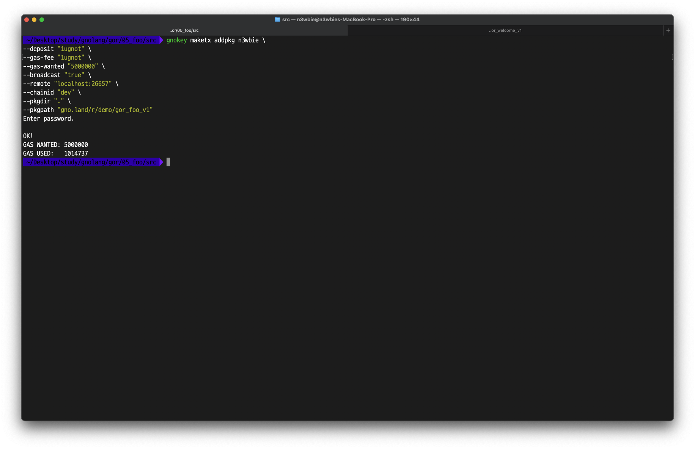
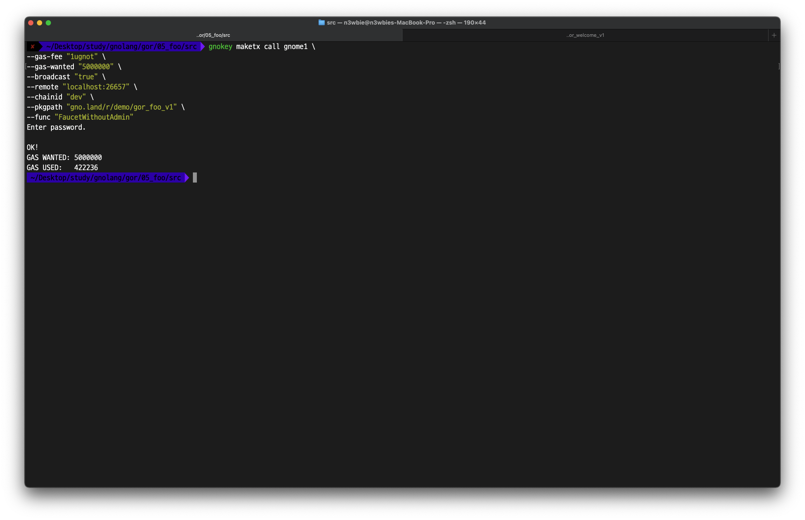
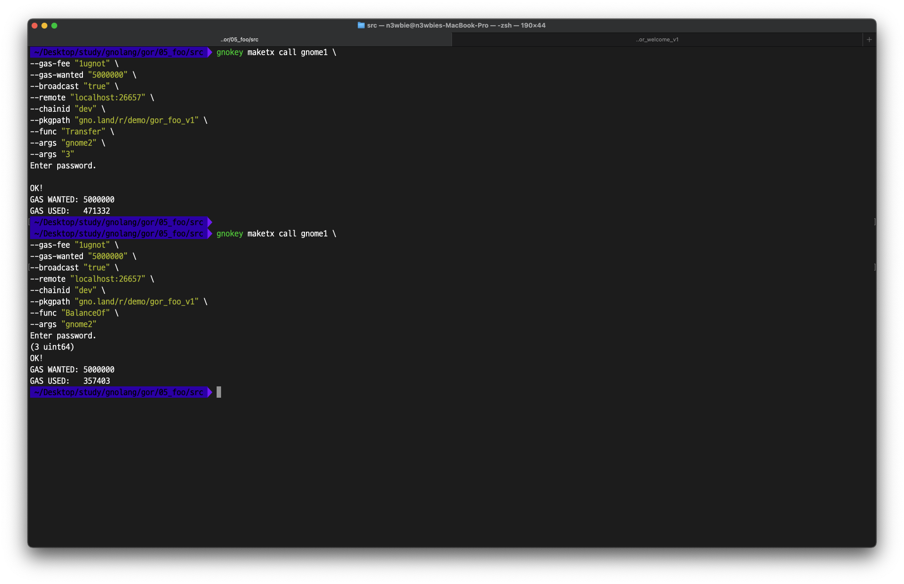

# foo20.gno

The `grc20` package is an implementation of the `erc20` standard in Gnolang.

In this section, we'll be learning how to import the `grc20` package in the `gno.land/p/demo/grc/grc20` path to deploy the `foo` realm that we'll use to mint `foo` tokens.

Let's first break down the code by segments.

```go
package foo

import (
	"errors"
	"std"
	"strings"

	"gno.land/p/demo/avl"
	"gno.land/p/demo/grc/grc20"
	"gno.land/p/demo/ufmt"
	"gno.land/r/demo/users"
)

var (
	foo   *grc20.AdminToken
	admin std.Address = "g1tntwtvzrkt2gex69f0pttan0fp05zmeg5yykv8"
)
```

We first import packages and realms that we'll be using in the `foo` realm. Then, we reset the `foo` variable and the admin address implemented in the `AdminToken` in `grc20`.

> **Note:** The `admin` address will be the only address that can can mint or burn tokens.


```go
func assertIsAdmin() error {
	caller := std.GetOrigCaller()
	if caller != admin {
		return errors.New("you're not admin")
	}
	return nil
}
```

The `asserIsAdmin()` function implements a logic to check if the caller of the admin-only function is the `admin` address. This concept is similar to the `require` or `modifer` in Solidity.


```go
func init() {
	foo = grc20.NewAdminToken("Foo Token", "FOO", 4)
	foo.Mint(admin, 100)
}
```

The `init()` function resets the package and creates the `foo` token with the following specifications.

* Name: `Foo Token`
* Symbol: `FOO`
* Decimals: `4`

Then, the function mints 100 `foo` tokens to the `admin` address.


```go
func Mint(address users.AddressOrName, amount uint64) error {
	if err := assertIsAdmin(); err != nil {
		return err
	}
	foo.Mint(address.Resolve(), amount)
}

func Burn(address users.AddressOrName, amount uint64) error {
	if err := assertIsAdmin(); err != nil {
		return err
	}

	foo.Burn(address.Resolve(), amount)
	return nil
}
```

The `Mint` function and the `Burn` function respectively handles minting and burning of tokens. Both functions verify that the caller is the admin using the `assertIsAdmin()` function declared above.


```go
func TotalSupply() uint64 {
	return foo.TotalSupply()
}

func BalanceOf(account users.AddressOrName) uint64 {
	balance, err := foo.BalanceOf(account.Resolve())
	if err != nil {
		panic(err)
	}
	return balance
}

func Transfer(to users.AddressOrName, amount uint64) {
	caller := std.GetOrigCaller()
	foo.Transfer(caller, to.Resolve(), amount)
}

func FaucetWithAdmin() error {
	if err := assertIsAdmin(); err != nil {
		return err
	}
	caller := std.GetOrigCaller()
	foo.Mint(caller, 200)
	return nil
}

func FaucetWithoutAdmin() {
	caller := std.GetOrigCaller()
	foo.Mint(caller, 200) 
}

func Allowance(owner, spender users.AddressOrName) uint64 {
	allowance, err := foo.Allowance(owner.Resolve(), spender.Resolve())
	if err != nil {
		panic(err)
	}
	return allowance
}

func Approve(spender users.AddressOrName, amount uint64) error {
	owner := std.GetOrigCaller()

	if err := foo.Approve(owner, spender.Resolve(), amount); err != nil {
		return err
	}
	return nil
}

func TransferFrom(from, to users.AddressOrName, amount uint64) error {
	spender := std.GetOrigCaller()
	if err := foo.TransferFrom(spender, from.Resolve(), to.Resolve(), amount); err != nil {
		return err
	}
	return nil
}

```

Other functions implement the specifications of ERC20 with 2 additional functions for the `Faucet`. Each function is explained below.

`Total Supply`: Returns the total supply of tokens.

`BalanceOf`: Returns the `foo` token balance of an address.

`Transfer`: Transfers `foo` tokens.

`FaucetWithAdmin`: Mints 200 `foo` tokens to an address (admin-only).

`FaucetWithoutAdmin`: Mints 200 `foo` tokens to an address (public).

`Allowance`: Returns the amount `owner`'s tokens that the `spender` can transfer on behalf of the `owner`.&#x20;

`Approve`: Grants the `spender` with the authority to send a defined amount of `caller`'s `foo` tokens on behalf of the `caller`.

TransferFrom: The `spender` sends `owner`'s tokens on behalf of the `owner`.&#x20;

####

### Test Code

```go
// foo_test.gno

package foo

import (
	"std"
	"strings"
	"testing"
	"errors"

	"gno.land/p/demo/avl"
	"gno.land/r/demo/users"
)

func Test(t *testing.T) {
	admin := users.AddressOrName("g1tntwtvzrkt2gex69f0pttan0fp05zmeg5yykv8")
	test2 := users.AddressOrName(testutils.TestAddress("test2"))
	recv := users.AddressOrName(testutils.TestAddress("recv"))
	normal := users.AddressOrName(testutils.TestAddress("normal"))
	owner := users.AddressOrName(testutils.TestAddress("owner"))
	spender := users.AddressOrName(testutils.TestAddress("spender"))
	recv2 := users.AddressOrName(testutils.TestAddress("recv2"))
	mibu := users.AddressOrName(testutils.TestAddress("mint_burn"))
	std.TestSetOrigCaller(admin.Resolve())

	// init()
	shouldEqual(t, foo.GetName(), "Foo Token")
	shouldEqual(t, strings.TrimSpace(foo.GetName()), "Foo Token")
	assertGRC20Balance(t, admin, 100)

	// TotalSupply()
	shouldEqual(t, foo.TotalSupply(), 100)

	// BalanceOf()
	assertGRC20Balance(t, admin, 100)

	// Transfer()
	std.TestSetOrigCaller(admin.Resolve())
	Transfer(recv, 20)
	assertGRC20Balance(t, admin, 80)
	assertGRC20Balance(t, recv, 20)

	// Faucet With/Without Admin
	std.TestSetOrigCaller(admin.Resolve())
	FaucetWithAdmin()
	assertGRC20Balance(t, admin, 280)
	shouldEqual(t, foo.TotalSupply(), 300)

	
	std.TestSetOrigCaller(normal.Resolve())
	assertErr(t, FaucetWithAdmin()) // must fail, since `normal` isn't admin
	
	FaucetWithoutAdmin()
	assertGRC20Balance(t, normal, 200)
	shouldEqual(t, foo.TotalSupply(), 500)

	// Approve && Allowance && TransferFrom
	std.TestSetOrigCaller(owner.Resolve())
	FaucetWithoutAdmin()
	FaucetWithoutAdmin()
	FaucetWithoutAdmin()
	assertGRC20Balance(t, owner, 600)

	Approve(spender, 300) 
	shouldEqual(t, Allowance(owner, spender), 300)	

	std.TestSetOrigCaller(spender.Resolve())
	assertNoErr(t, TransferFrom(owner, recv2, 150))
	assertGRC20Balance(t, owner, 450)
	assertGRC20Balance(t, recv2, 150)
	shouldEqual(t, Allowance(owner, spender), 150)
	assertErr(t, TransferFrom(owner, recv2, 151))

	// Mint
	std.TestSetOrigCaller(admin.Resolve())
	Mint(mibu, 500)
	assertGRC20Balance(t, mibu, 500)

	// Burn
	std.TestSetOrigCaller(admin.Resolve())
	Burn(mibu, 490)
	assertGRC20Balance(t, mibu, 10)
}


func shouldEqual(t *testing.T, got interface{}, expected interface{}) {
	t.Helper()

	if got != expected {
		t.Errorf("expected %v(%T), got %v(%T)", expected, expected, got, got)
	}
}

func assertErr(t *testing.T, err error) {
	t.Helper()
	if err == nil {
		t.Errorf("expected an error, but got nil.")
	}
}

func assertNoErr(t *testing.T, err error) {
	t.Helper()
	if err != nil {
		t.Errorf("expected no error, but got err: %s.", err.Error())
	}
}

func assertNativeBalance(t *testing.T, addr std.Address, denom string, expectedBal uint64) {
	t.Helper()

	banker := std.GetBanker(std.BankerTypeReadonly)
	coins := banker.GetCoins(addr)
	got := coins.AmountOf(denom)

	if got != expectedBal {
		t.Errorf("invalid balance: expected %v, got %v.", expectedBal, got)
	}
}

func assertGRC20Balance(t *testing.T, addr users.AddressOrName, expectedBal uint64) {
	got := BalanceOf(addr)

	if got != expectedBal {
		t.Errorf("invalid balance: expected %v, got %v.", expectedBal, got)
	}
}
```

> **Tip:** the `boards` realm enables users to [register addresses with usernames](https://onbloc.gitbook.io/gnoland-developer-portal/tutorials/cli/cli-examples#register-as-a-user) on  `/r/demo/boards` for simplicity and convenience.&#x20;


Let's assume that 3 addresses have been registered as users as the following:

|                  Address                 | Username |
| :--------------------------------------: | :------: |
| g1cq2ecdq3eyn5qa0fzznpurg87zq3k77g63q6u7 |  gnome1  |
| g1avcw0qwyays4dl4j9l9hp0cd4gr9vhm79hty2w |  gnome2  |
| g1xvy0ra4wkpnwc3fey05et2y6g8s882fmgwmn4p |  gnome3  |

<figure><figcaption></figcaption></figure>

<figure><figcaption></figcaption></figure>

<figure><figcaption></figcaption></figure>

In the images above, after deploying the `foo` realm, user `gnome1` has successfully received 200 `foo` tokens from the faucet. Then, the balance of user `gnome2` was successfully returned using the username as the argument instead of the actual address.
