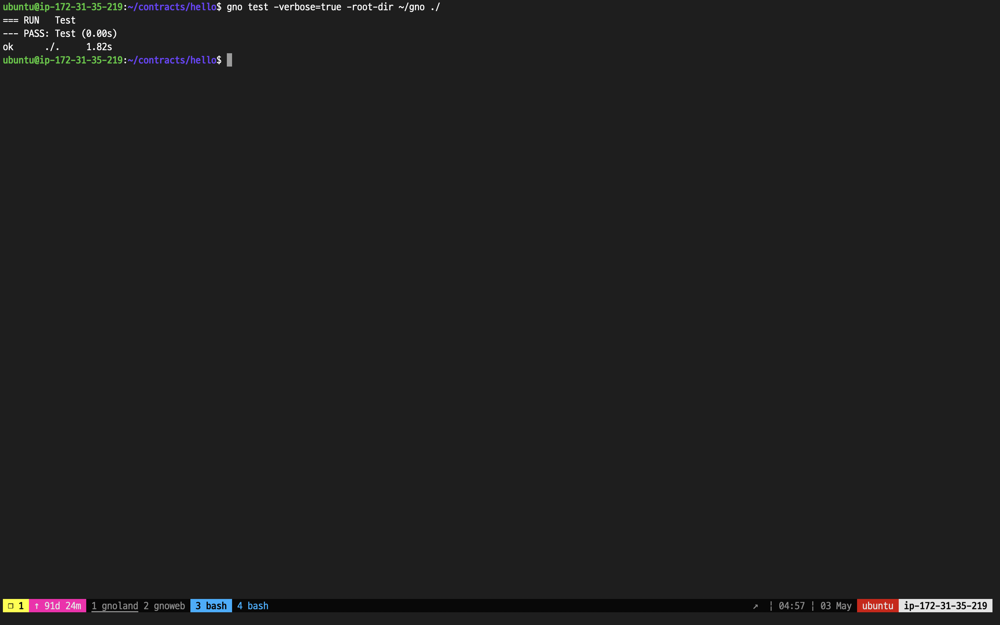

# hello.gno

### **Realm Code**

```go
// hello.gno

package hello

func Hello() string {
	return "Hello() called"
}

// func Render() string {
// 	return "Render() called"
// }

func Render(path string) string {
	return "Render(path string) called with\n# " + path
}
```

The `hello` realm is a simple code that returns a string by declaring the `Hello()` function and the `Render()` function.

`Hello()` can be called without an argument, but`Render()` must be called with a string-typed `path` parameter.

> **Note:** Like Golang, function overloading is not supported in Gnolang.

### **Test Code**

```go
// hello_test.gno

package hello

import "testing"

func Test(t *testing.T) {
	{
		got := Hello()
		expected := "Hello() called"
		if got != expected {
			t.Fatalf("expected %q, got %q.", expected, got)
		}
	}

	{
		got := Render("")
		expected := "Render(path string) called with\n# "
		if got != expected {
			t.Fatalf("expected %q, got %q.", expected, got)
		}
	}

	{
		got := Render("n3wbie")
		expected := "Render(path string) called with\n# n3wbie"
		if got != expected {
			t.Fatalf("expected %q, got %q.", expected, got)
		}
	}
}
```

Let's test the code using `gnodev test`.

<figure><figcaption></figcaption></figure>

Then, let's publish the realm with `gnokey addpkg`.

<figure><figcaption></figcaption></figure>

Now, let's call the `Render()` function using all three methods.

### **1. Visiting the website**

<figure><figcaption></figcaption></figure>

It is specified in the realm code that the `Render()` function must be invoked with the path string argument. However, the image provided illustrates that no additional characters have been concatenated to the end of the URL link.

<figure><figcaption></figcaption></figure>

The argument can be specified in the URL with the colon `:`.

### **2. The `maketx call` option using `gnokey`**

<figure><figcaption></figcaption></figure>

The image above is an example of calling the function using `maketx call`.

It should be noted that when the `(path string)` argument is declared within the realm code, a failure to explicitly include an empty argument will result in an inability to successfully execute the function.

The drawback of using the `maketx call` method is that it consumes gas, as it creates an actual transaction on the network.

Functions that make changes to the state must have a subject for change, hence must create an actual transaction with options such as `caller`, `gas-fee`, and `gas-wanted`. In this case, however, as data retrieval without any state changes to the blockchain is out main objective, we can use the next method (`query vm/qrender`) to achieve the same result without spending any gas.

### **3. The `query vm/qrender` option using `gnokey`**

<figure><figcaption></figcaption></figure>

This method involves seemingly fewer options compared to `gnokey maketx call` method. However, passing the argument can be quite confusing: the realm path that exposes the `Render()` function must be placed in the `--data` option, and the arguments in a new line (`\n`).


If we return to our realm code, we can see that the other function, `Hello()`, also doesn't cause any state changes to the blockchain.

Any other function besides `Render()` can be invoked with `gnokey query vm/qeval`.

<figure><figcaption></figcaption></figure>

In the image above, the first command uses the `gnokey maketx call` to call the function, and the second command uses the `gnokey query vm/qeval`.

It should be noted that there are distinct variations in the argument requirements between `vm/qeval` and `vm/qrender`. Specifically, when utilizing the `vm/qeval` method, it is mandatory to specify the function to be invoked and the corresponding parameters, immediately following a new line.

The `Hello()` function does not require any parameters, so the call can be executed by only specifying the function.

The `Render()` function can also be called with `eval`, but a distinct escaping (other than a single quotation ` `` `) should be used when passing a string-typed argument as seen in the third method in the image above.
