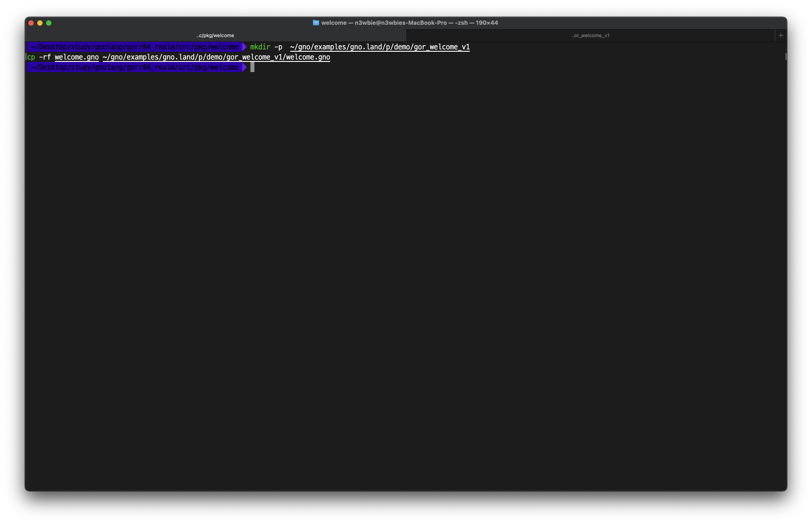
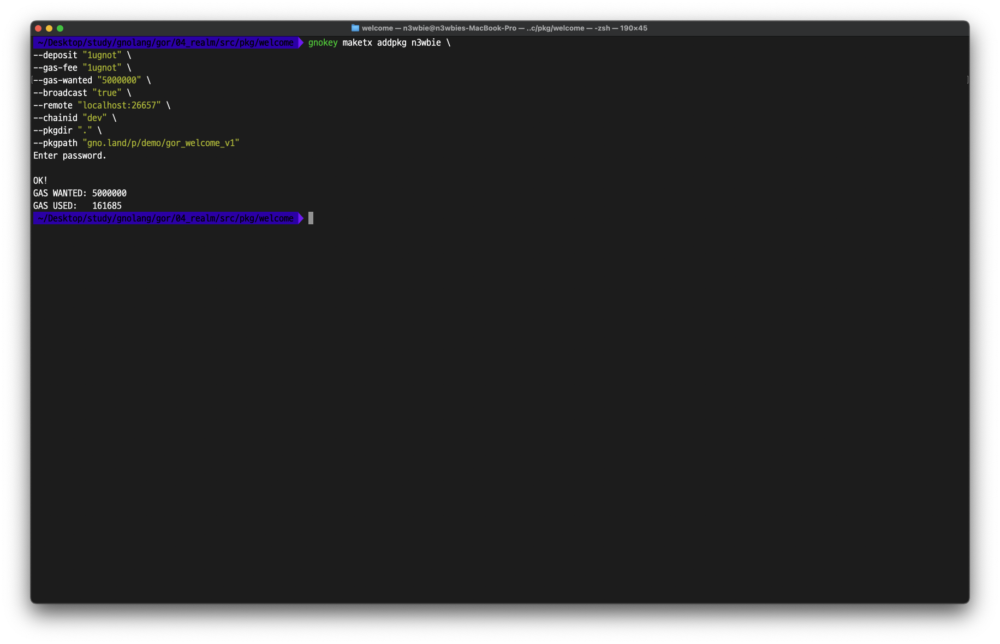
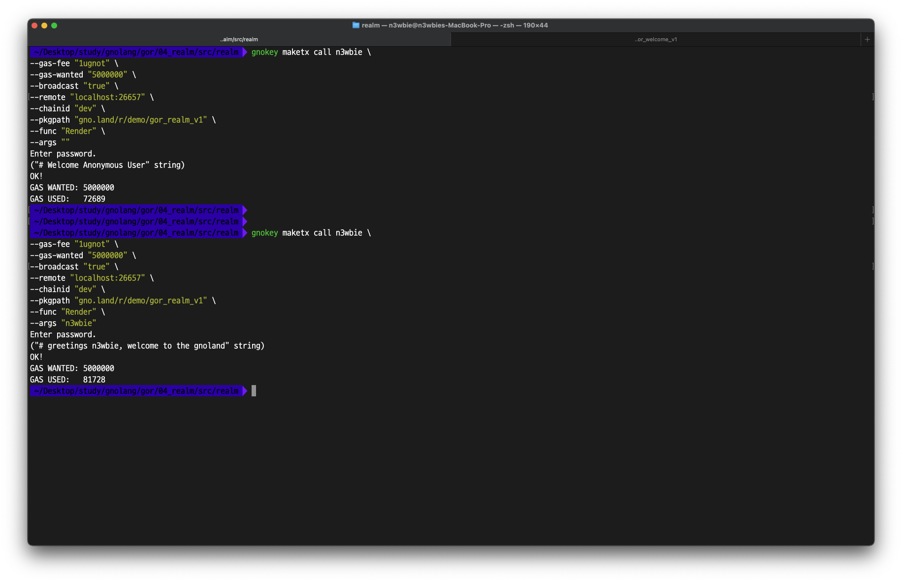
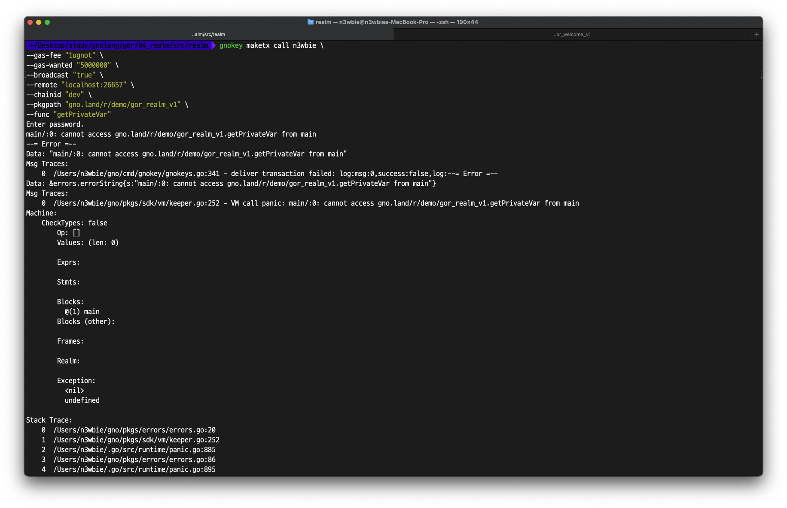
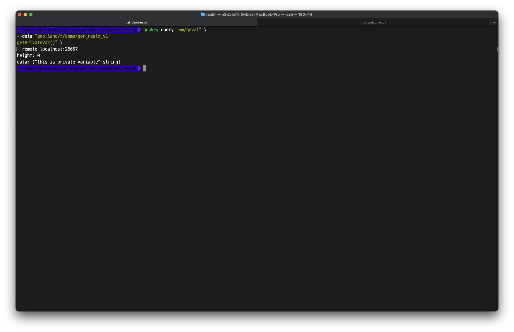

# realm.gno

The `realm` realm provides a guide on how to import packages in a test environment (`gnodev`) and the production environment (`gnokey addpkg`) along with precautions to note.


First, let's write a test package:

```go
// welcome.gno

package welcome


var MsgOfPkg = "this is a public variable"
var msgOfPkg = "this is a private variable"

func GetPrivVar() string {
	return msgOfPkg
}

func Gnome(name string) string {
	return "greetings " + name + ", welcome to the gnoland"
}
```

The `welcome` package contains the declaration of two variables and functions. These two variables have separate functionality for public and private usage. All functions within the package are designated as public.

The `msgOfPkg` is a private function, thus it is inaccessible for direct external access. We, therefore, use the `GetPriveVar()` function for indirect external access.

Next, we'll import the package above in both the test environment and the production environment.

### **Importing in the test environment**

In the test environment, we will copy the file, as `gnodev` imports the package with the physical file path.

<figure><figcaption></figcaption></figure>

### Importing in a production environment

In the production environment, we will run the `maketx addpkg` command to actually deploy the package to the network.

<figure><figcaption></figcaption></figure>

### Realm Code

```go
// realm.gno

package realm

import (
	"gno.land/p/demo/gor_welcome_v1"
)

func Render(name string) string {
	if name == "" {
		return "# Welcome Anonymous User"
	} 

	return "# " + welcome.Gnome(name)
}

func GetPublicVar() string {
	return welcome.MsgOfPkg
}

func getPrivateVar() string {
	return welcome.GetPrivVar()
}
```

The `realm` realm imports the pre-deployed `welcome` package and declares 3 functions. The `Render()` function and the `GetPublicVar()` function are public, while the `getPrivateVar()` is private.

### Test Code

```go
// realm_test.gno

package realm

import "testing"


func TestWelcomeAnon(t *testing.T) {
	expected := "# Welcome Anonymous User"
	got := Render("")
	if got != expected {
		t.Fatalf("expected %q, got %q.", expected, got)
	}
}

func TestWelcomeUser(t *testing.T) {
	expected := "# greetings n3wbie, welcome to the gnoland"
	got := Render("n3wbie")
	if got != expected {
		t.Fatalf("expected %q, got %q.", expected, got)
	}
}

func TestGetPublicVar(t *testing.T) {
	expected := "this is public variable"
	got := GetPublicVar()
	if got != expected {
		t.Fatalf("expected %q, got %q.", expected, got)
	}	
}

func TestGetPrivateVar(t *testing.T) {
	expected := "this is private variable"
	got := getPrivateVar()
	if got != expected {
		t.Fatalf("expected %q, got %q.", expected, got)
	}	
}
```

### **Result**

<figure><figcaption></figcaption></figure>

We can confirm that the test has been successfully passed in the test environment using `gnodev`.&#x20;


<figure><figcaption></figcaption></figure>

The package gets added successfully in the production environment.


<figure><figcaption></figcaption></figure>

Calling `Render()` and `GetPublicVar()` using the `gnokey maketx call` also works as expected.


<figure><figcaption></figcaption></figure>

However, unlike the results in `gnodev`, we run into an issue when calling the `getPrivateVar()` function using the `gnokey maketx call` command in the production environment.


<figure><figcaption></figcaption></figure>

On the other hand, calling the `getPrivateVar()` function using the `gnokey query vm/qeval` command works successfully.


## TODO

* As of testnet3, we have run into unexpected results when using access modifiers with `gnodev`, `maketx`, and `query`. We suspect the cause to be one of the following:
  * GnoVM&#x20;
  * Gnokey Query
  * Gnodev
* As of now, we can get around this error by changing the uppercase to the lowercase to publicly access it.
* This section will be updated once the cause of this phenomenon is determined.
