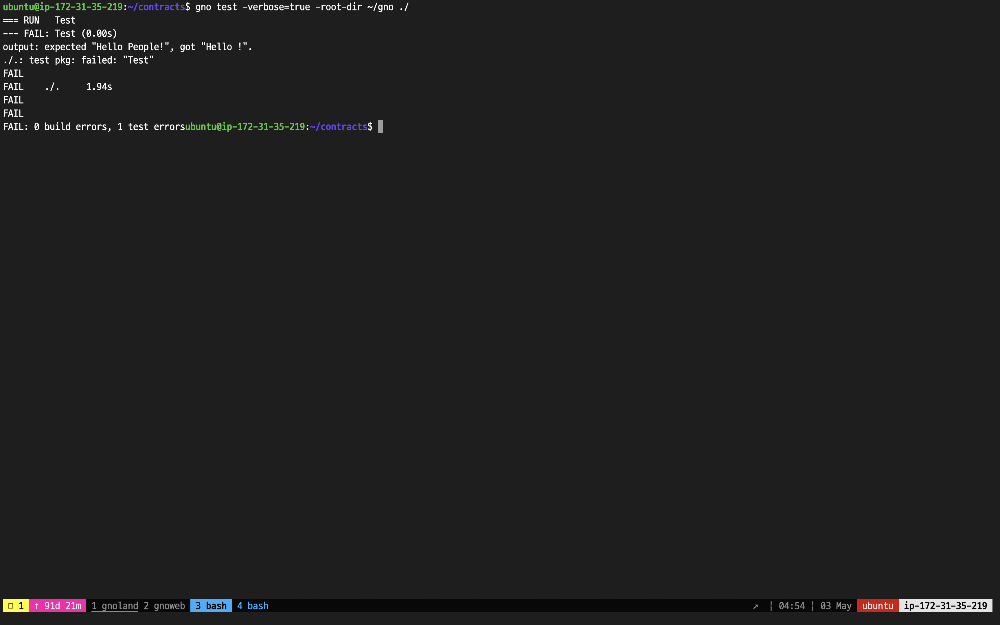

# Test Realms

There are two methods for testing a realm or package during the development phase.

1. Calling the realm/packages after deploying it on a local network (or testnet3).
2. Using the `test` option of [`gno`](../cli/gno.md).

While the first method is recommended for its accuracy and similarity to the actual deployment environment, it is more efficient to initially utilize the second method for composing test cases and then proceed to the first method if no errors are detected.

This section will teach you how to use the second method.

Writing test cases in Gnolang is similar to that of Golang, with general rules as the following:

* Naming conventions must be adhered (ex: `xxx_test.gno`)
* The function name of test cases must start with `Test`.
* The `t *testing.T` argument must be included.
  * The `testing` package must be imported.
* Tests must be run with the `gno test` command.

Let's write a sample code and test it.

```go
// contract.gno

package demo

func Hello(name string) string {
	return "Hello " + name + "!"
}
```

This is a simple code that returns the string-typed argument in a specific format.

Next, we'll write a test case that looks like the following:

```go
// contract_test.gno

package demo

import "testing"

func Test(t *testing.T) {
  {
  	got := Hello("People")
  	expected := "Hello People!"
  	if got != expected {
  		t.Fatalf("expected %q, got %q.", expected, got)
  	}
  }
  {
  	got := Hello("")
  	expected := "Hello People!"
  	if got != expected {
  		t.Fatalf("expected %q, got %q.", expected, got)
  	}
  }
}
```

Two conditions exist in the test case above.

1. "Hello People!" should be returned when calling `Hello("People")`.
2. "Hello People!" should be returned when calling `Hello("")`.

<figure><figcaption><p>Testing with <code>gno</code></p></figcaption></figure>

Upon examination of our realm code and the associated test results, the initial condition exhibited the desired behavior. However, an error was identified in the second condition. Despite the expected outcome of "Hello" being returned, the test case incorrectly specified that the expected output should be "Hello People!" instead.

Replacing the second part of the code as the following will successfully fix the issue.

```go
  {
  	got := Hello("")
  	expected := "Hello !"
  	if got != expected {
  		t.Fatalf("expected %q, got %q.", expected, got)
  	}
  }
```
