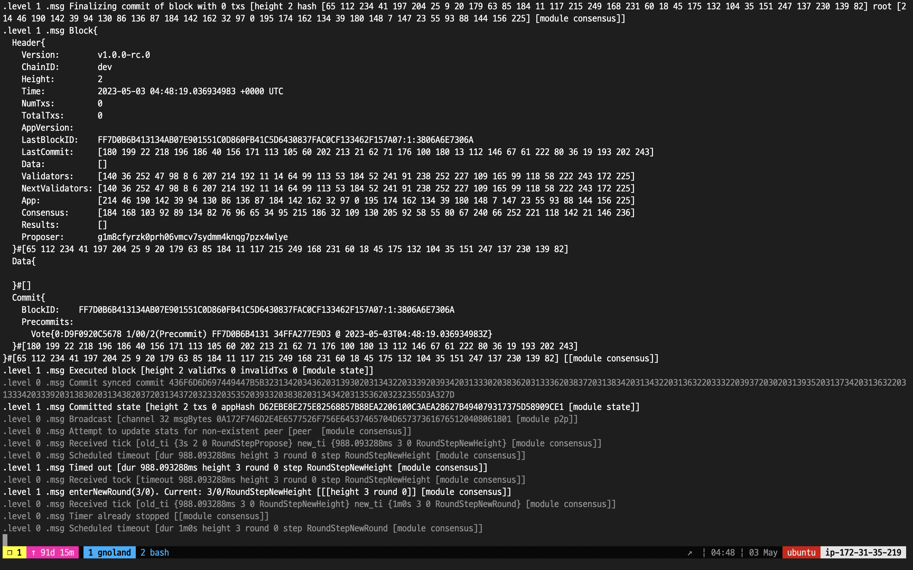
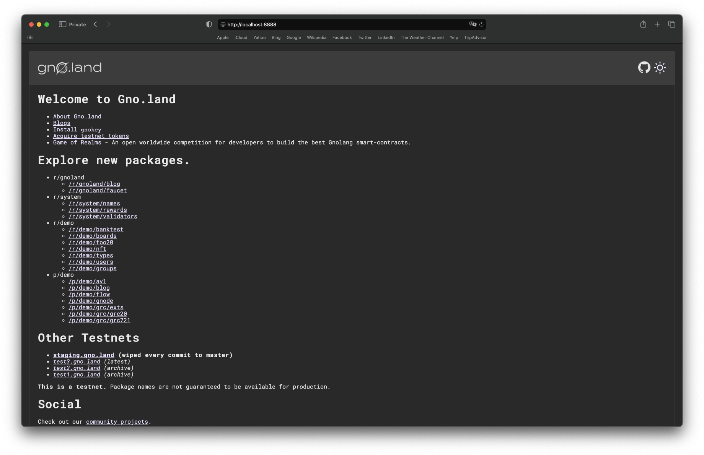

# Build the Local Testnet

### Step 1. Build the Gno Project

Change your working directory to `gno/gno.land`.

```bash
$ cd ~/gno/gno.land/
```

Use the `make` command to build the gnoland binary.

```bash
$ make install.gnoland
```

<figure><figcaption></figcaption></figure>

> **Note:** If you're developing on a Windows device, install the GNU make using this [link](https://gnuwin32.sourceforge.net/packages/make.htm).


### Step 2. Run a Local Node

Start a local Gnoland blockchain node with the following command:

```bash
$ gnoland
```

<figure><figcaption></figcaption></figure>

<figure><figcaption></figcaption></figure>

After a few moments, you will start to see blocks being produced on your network.

### Step 3. Build a Web Page (Optional)

This section will teach you how to launch your own gno.land web page that will serve as a docs page for your network. Although this section is optional, we highly recommend completing it.

First, build the web page with the following command:

```
$ make install.gnoweb
```

Then, run the web page with the following command:

```
$ gnoweb
```

<figure><figcaption></figcaption></figure>

To confirm that your web page is running on your network, use a browser to access the following link:



<figure><figcaption></figcaption></figure>

Under the **Explore new packages.** section, you will see a list of pre-built realms and packages that are already deployed on your network. You may click on each one to view its details.
