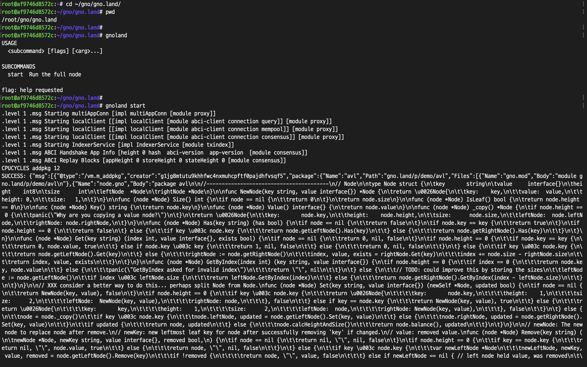

# Build the Local Testnet

## Prerequisites

- [Initial Setup](../environment-setup/initial-setup.md)

### Step 1. Run a Local Node

Start a local Gnoland blockchain node with the following command:

```bash
gnoland
```

<figure><figcaption></figcaption></figure>

<figure><figcaption></figcaption></figure>

After a few moments, you will start to see blocks being produced on your network.

### Step 3. Build a Web Page (Optional)

This section will teach you how to launch your own gno.land web page that will serve as a docs page for your network. Although this section is optional, we highly recommend completing it.

#### Prerequisites

- [Initial Setup - Build gnoweb](../environment-setup/initial-setup.md#build-gnoweb)

Run the web page with the following command:

```
gnoweb
```

<figure><figcaption></figcaption></figure>

To confirm that your web page is running on your network, use a browser to access the following link:



<figure><figcaption></figcaption></figure>

Under the **Explore new packages.** section, you will see a list of pre-built realms and packages that are already deployed on your network. You may click on each one to view its details.
