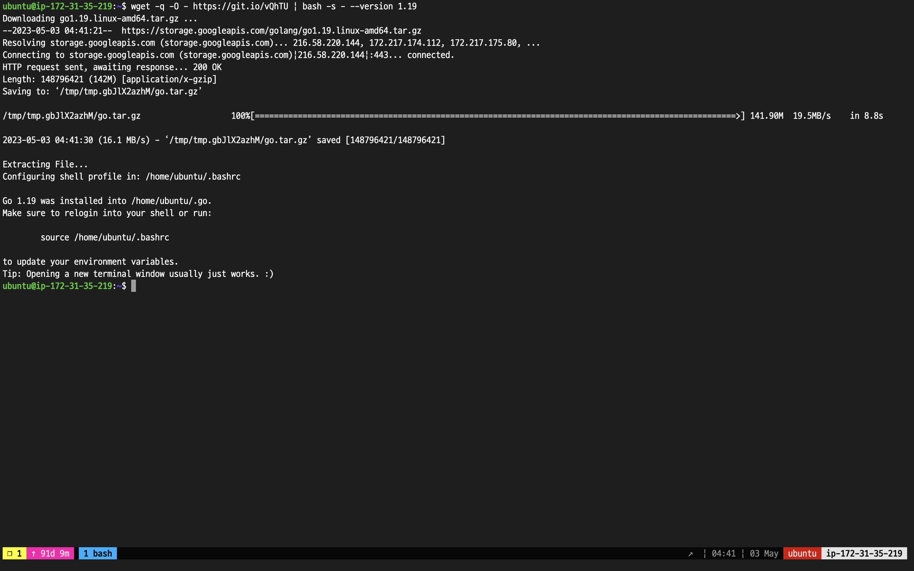
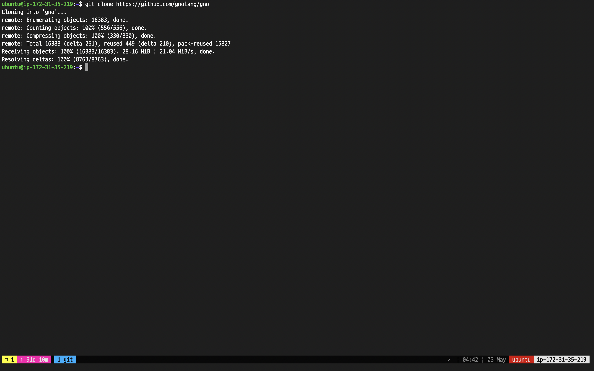
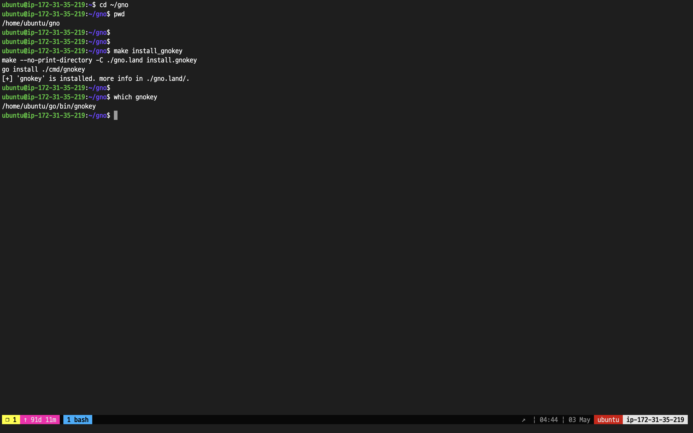

# Initial Setup

### Step 1. Install Git

To install Git, click on [this link](https://git-scm.com/downloads) to download the installer, or run the following script on your CLI:

```bash
$ sudo apt update; sudo apt install git-all -y;
```

<figure><figcaption></figcaption></figure>

### Step 2. Install Go

To install Go, click on [this link](https://go.dev/dl/) to download the installer, or run the following script on your CLI:

```bash
$ wget -q -O - https://git.io/vQhTU | bash -s - --version 1.19
```

<figure><figcaption></figcaption></figure>

### Step 3. Clone the `gno` Repository

Clone the official `gno` Repository using the following command:

```bash
$ git clone https://github.com/gnolang/gno
```

<figure><figcaption></figcaption></figure>

### Step 4. Build `gnokey`

```bash
$ cd ~/gno && make install_gnokey
```

<figure><figcaption></figcaption></figure>
