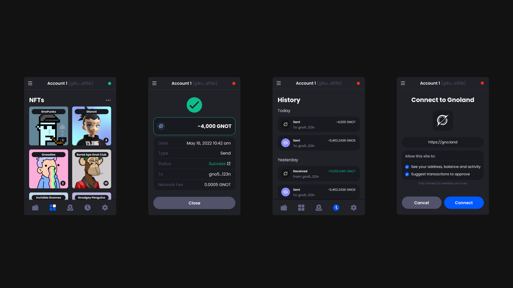

# Developer Tools

## [Adena Wallet](https://adena.app/)

Adena is the flagship non-cusotidal wallet of Gnoland. It provides you with a friendly interface for creating a wallet, sending transactions, and connecting to dapps.

<figure><figcaption></figcaption></figure>

<figure><figcaption></figcaption></figure>

<figure><figcaption></figcaption></figure>

## [Gnoscan](https://gnoscan.io/)

Gnoscan is a Gnoland explorer that makes on-chain data legible and intuitive for everyone. It provides you with an on-chain data analytics platform that shows transactions, realms, users, tokens, and much more.

<figure><figcaption></figcaption></figure>

<figure><figcaption></figcaption></figure>

<figure><figcaption></figcaption></figure>

## [Gnotools](https://app.gno.tools/)

Gnotools is a frontend for realms on Gnoland. It provides you with an interface for creating boards, leaving replies, registering as a user, and requesting for GNOTs from the faucet.

<figure><figcaption></figcaption></figure>

<figure><figcaption></figcaption></figure>

<figure><figcaption></figcaption></figure>

## [Gnoland Space](https://gnoland.space/)

Gnoland Space is a community-driven Gnoland wiki. It provides you with guides, resources, and interfaces for interacting with Gnoland.

<figure><figcaption></figcaption></figure>

<figure><figcaption></figcaption></figure>

<figure><figcaption></figcaption></figure>

