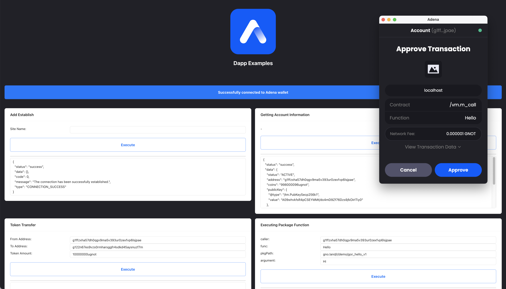

# Build a Demo Dapp

This sample is to guide you on how an app interacts with Adena, a wallet built using the Gnoland RPC endpoints. You can play around with a sample dapp [here](https://onbloc.github.io/dapp-example/), you can also find the source [here](https://github.com/onbloc/dapp-example).

### Dapp Example - Demo Project

<figure><figcaption><p>Dapp Example Demo Image</p></figcaption></figure>

## Project Setup

> Tip: It is recommended that you visit and go through [Wallet Integration](../resources/developer-tools/wallet-integration.md) before starting the setup.

Make sure you:

1. Download the [Adena Extension](https://chrome.google.com/webstore/detail/adena/oefglhbffgfkcpboeackfgdagmlnihnh).
2. Install Node Packages.

```
$ npm install
```

3. Start the project

```
$ npm start
```

4. Build the project

```
$ npm build
```
