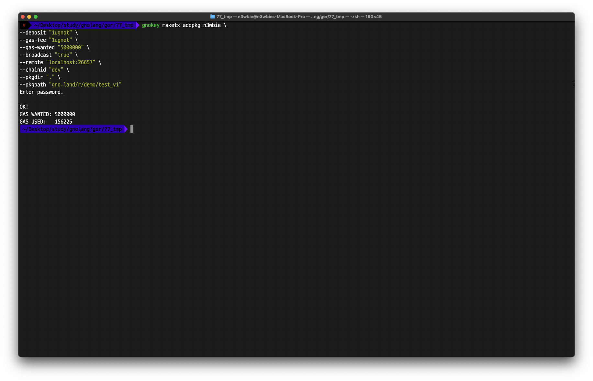
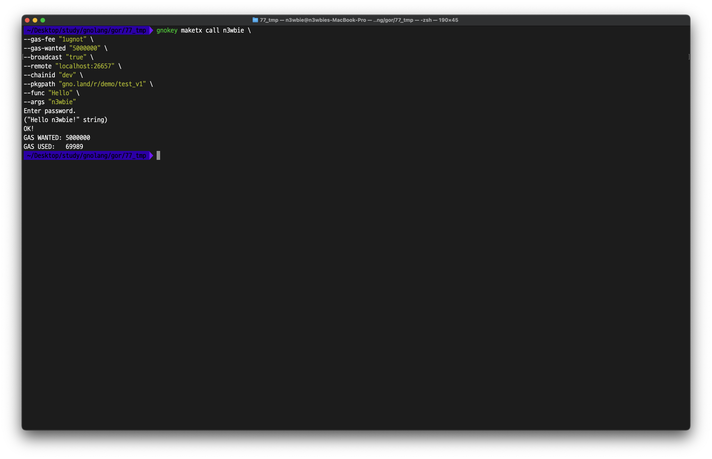

# Deploy and Call Realms

Using `gno` enables testing within a local development environment. However, it does not facilitate the capability for external parties to participate in testing.

Use the `addpkg` subcommand of `gnokey` to publicly deploy realms.

<figure><figcaption></figcaption></figure>

Then, call the realm with the `maketx call` subcommand.

<figure><figcaption></figcaption></figure>
