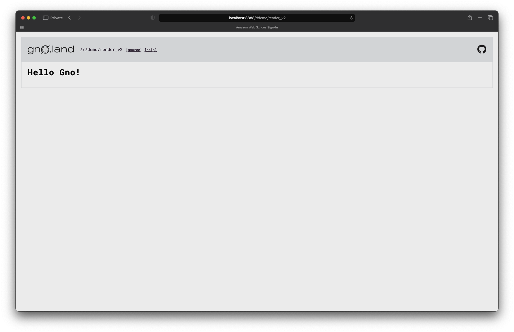
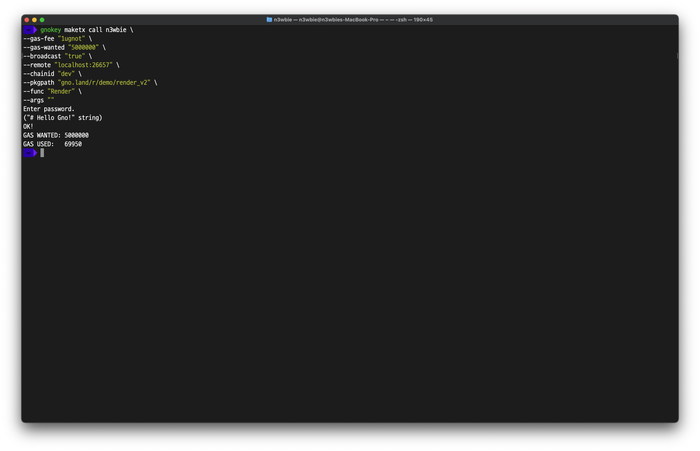
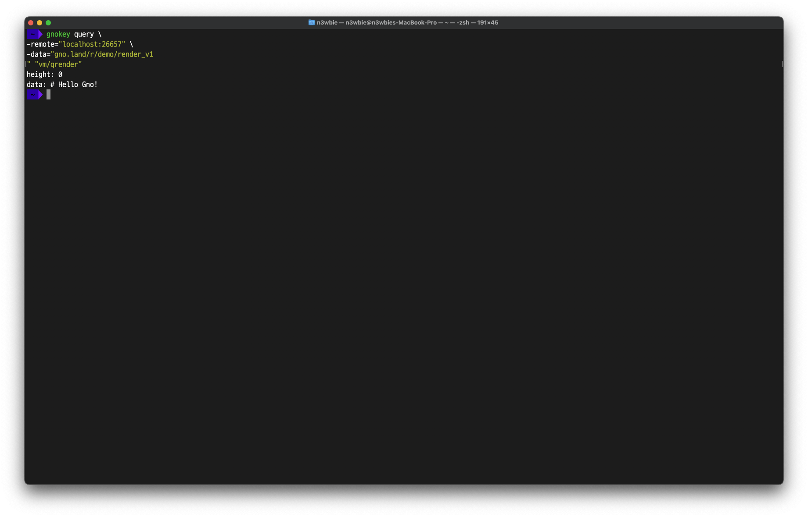

# Writing Realms

Before diving in, let's compare realms to packages to clarify their differences.

### **Realms**

* Smart contracts written in Gnolang.
* Realms are stateful.
* The default import path is `gno.land/r/~~~`.
* The realm exposes a unique function called `Render()`, which performs rendering through markdown syntax.

### **Packages**

* A unit that contains functionalities and utilities that can be used in realms.
* Packages are stateless.
* The default import path is `gno.land/p/~~~`.
* Can be imported to other realms or packages.

## `Render`

As previously stated, the `Render()` supports markdown syntax. A sample code is as follows.

```go
package demo

func Render(path string) string {
	return "# Hello Gno!"
}
```

Upon calling the realm above, `# Hello Gno!`is printed with a string-typed `path` declared in an argument. It should be noted that, while the `path` argument included in the sample code is not utilized, it serves the purpose of distinguishing the path during the rendering process.

The `Render` function can be invoked through three distinct methods.

> **Note:** The examples below assume that the sample realm above has been deployed.

### **1. Visiting the website**

<figure><figcaption><p>Calling <code>Render</code> by visting the website</p></figcaption></figure>

Upon deployment of a realm, the `Render()` function can be invoked by specifying the path on the website, thereby enabling the rendering of markdown text.

### **2. The `maketx call` option using `gnokey`**

<figure><figcaption><p>Calling <code>Render</code> with <code>gnokey maketx call</code></p></figcaption></figure>

Instead of rendering, however, the raw markdown is printed.

### **3. The `query vm/qrender` option using `gnokey`**

<figure><figcaption><p>Calling <code>Render</code> with <code>gnokey query vm/qrender</code></p></figcaption></figure>

Similar to the 2nd method, the raw markdown is printed.

## Arguments

Similar to Golang, variables can be assigned with names and data types.

```go
package demo

func Hello(name string) string {
	return "Hello " + name + "!"
}
```

Although concrete data types of Golang are supported, `avl` packages must be used since `map` is unusable due to non-determinism.

## Data Handling

Data handling in Gnolang works similarly to data handling in Golang.

```go
package demo

var total int

func init() {
	total = 1000
}

func Add(nb int) int {
	total += nb
	return total
}
```

The code above globally declares an integer-typed `total` variable and sets its value to `1000`. Then it changes its value using the `Add()` function, by adding the number passed as the argument.

## Import

Importing in Gnolang also works similarly to importing in Golang.

```go
package demo

import (
	"gno.land/p/demo/avl"
	"gno.land/p/demo/dom"
)

func Render(path string) string {
	thread := dom.Plot{Name: "Hello!"}
	thread.AddPost("Foo", "foo foo foo")
	thread.AddPost("Bar", "bar bar bar")
	return thread.String()
}
```

The sample code above imports the `avl` package and the `dom` package.

## Access Modifier

In Gnolang, the distinction of access modifiers is based on the naming conventions of objects.

* Starting with an uppercase: Can be externally accessed == Public \~= public & external in Solidity
* Starting with a lowercase: Cannot be externally accessed == Private \~= private & internal in Solidity
