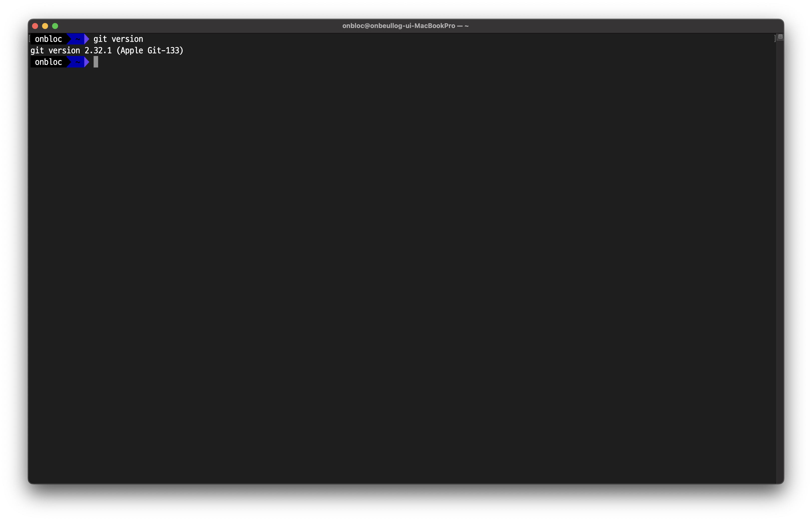
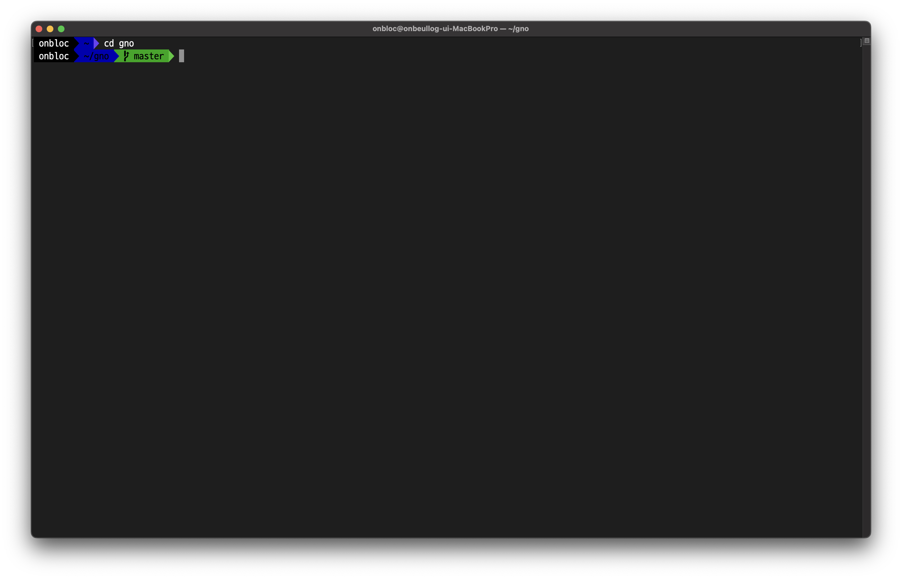
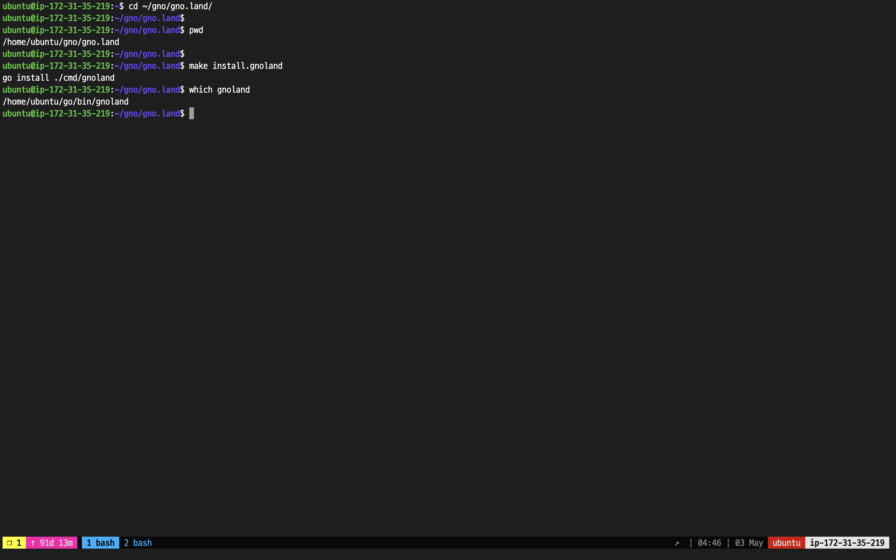
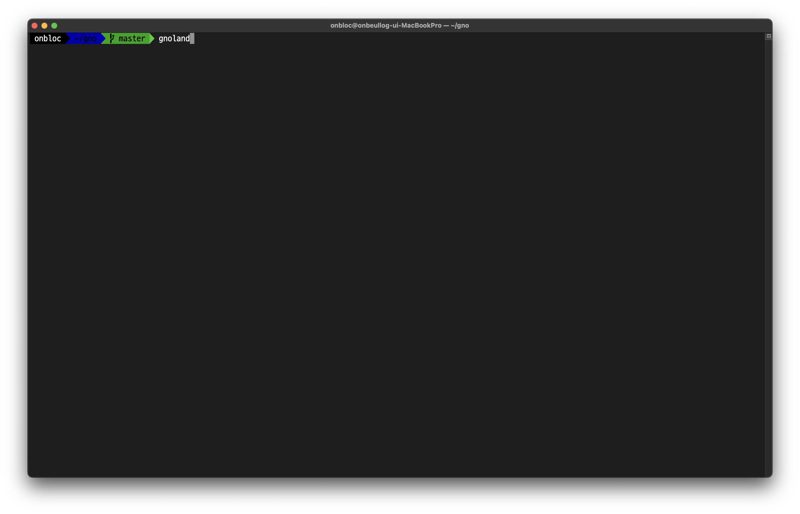

# Environment Setup

## Setting Up the Gno Project

### Step 1. Download Git

Click on this [link](https://git-scm.com/downloads) to download Git and run the following command to check the installed version.

```bash
$ git version
```

<figure><figcaption></figcaption></figure>

### Step 2. Install Go

Click on this [link](https://go.dev/dl/) to download Go and check the installed version.

```bash
$ go version
```

<figure><figcaption></figcaption></figure>

### Step 3. Clone the Gno Repository

Clone the official Gno Repository using the command below.

```bash
$ git clone git@github.com:gnolang/gno.git
```

<figure><figcaption></figcaption></figure>

## Configure Local Environment

### Step 1. Build the Gno Project

Change your working directory to `gno`.

```bash
$ cd gno
```

<figure><figcaption></figcaption></figure>

Use the `make` command to build the Gno project.

```bash
$ make
```

<figure><figcaption></figcaption></figure>

> **Note:** If you're developing on a Windows device, install the GNU make using this [link](https://gnuwin32.sourceforge.net/packages/make.htm).

### Step 2. Set the Path for Gno Commands

Register environment variables on Mac / Linux.

```bash
$ export PATH=$PWD/build:$PATH
```

Register environment variables on Windows.

```bash
$ set PATH=%cd%/build;%PATH%
```

### Step 3. Run a Local Node

Start a local Gnoland blockchain node with the command below.

```bash
$ gnoland
```

<figure><figcaption></figcaption></figure>

