# Start Writing a Realm

This tutorial will provide you with a step-by-step guide on how to set up a local environment, write a sample realm, and deploy it on Testnet 3.

## Prerequisites

* [Initial Setup](../docs/environment-setup/initial-setup.md)
* [Build the Local Testnet](../docs/environment-setup/build-the-local-testnet.md)

## Locally Building a Realm

In this section, we'll be building and deploying a realm and see how it's displayed on our web page.

### Demo Contract

```go
// contract.gno
package demo

func Hello(name string) string {
	return "Hello " + name + "!"
}
```

### Test Case

```go
// contract_test.gno
package demo

import "testing"

func Test(t *testing.T) {
  {
  	got := Hello("People")
  	expected := "Hello People!"
  	if got != expected {
  		t.Fatalf("expected %q, got %q.", expected, got)
  	}
  }
  {
  	got := Hello("")
  	expected := "Hello People!"
  	if got != expected {
  		t.Fatalf("expected %q, got %q.", expected, got)
  	}
  }
}
```


### Testing with `gnodev`

Due to the immutable nature of blockchain, it's a good practice to run tests on `gnodev` prior to deploying your realm on the testnet.&#x20;

Follow the steps in this section to test `contract_test.gno` without interacting with the blockchain using `gnodev`.

You must save your `contract.gno` and `contract_test.gno` files in the same directory, and that directory can by any of your chosing. For the examples below we'll assume that the contract is stored in the directory: `~/demo`.

#### Step 1. Build and Run `gnodev`

To build `gnodev`, use the following command:

```bash
$ make gnodev
```

Then, run it with the following command:

```
$ gnodev
```

<figure>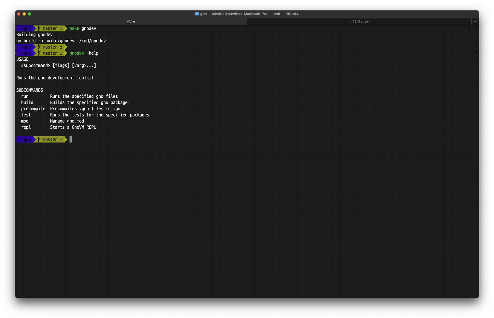<figcaption></figcaption></figure>

#### Step 2. Test Your Realm

Test your realm using the following command:

```bash
$ gnodev test ./ --verbose --root-dir ~/gno
```

> Note: `./` above assumes you are operating your terminal out of the same directory as your `contract.gno` and `contract_test.gno` files, if not adjust the path accordingly.

<figure>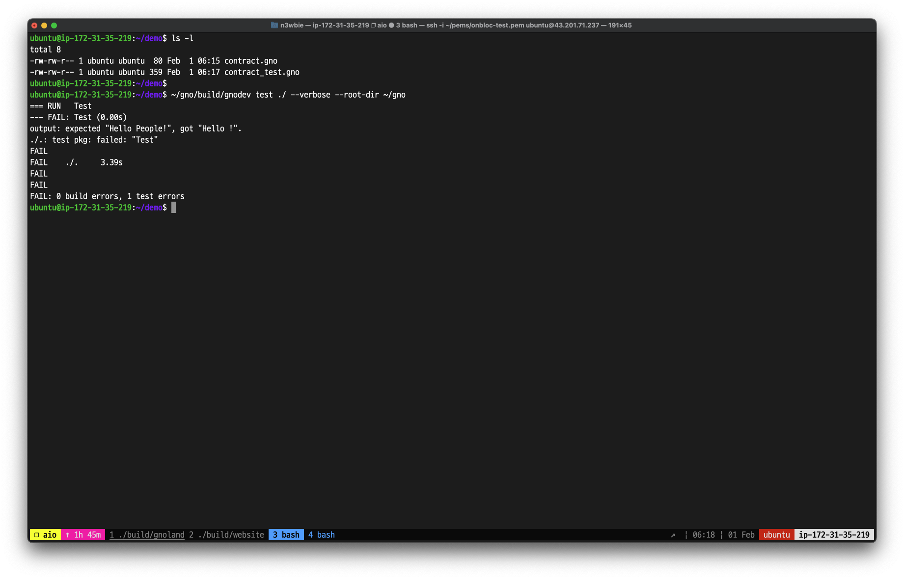<figcaption></figcaption></figure>

We can see that the test has failed. Try to find out what went wrong with our test on your own! ([Hint](https://onbloc.gitbook.io/gnoland-developer-portal/tutorials/building-a-realm/testing-realms))

<figure>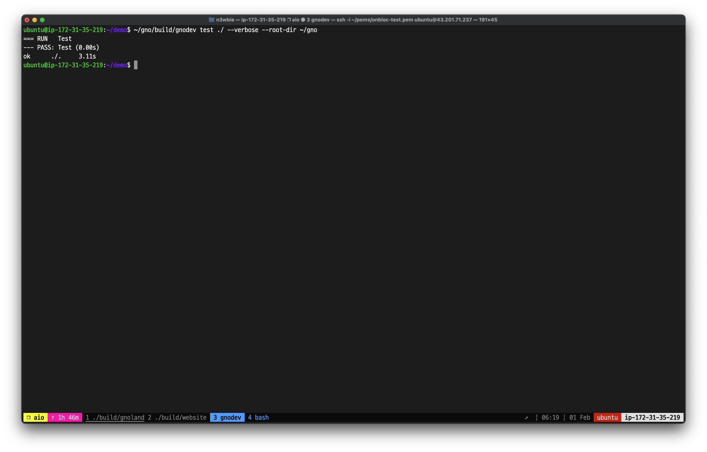<figcaption></figcaption></figure>

Once you fix the errors and re-run the test, you can confirm that the results are now displayed as  `PASS`, indicating that your realm is ready to be deployed on the blockchain.

### Deploying Locally

In order to deploy your realm, you must first create an account using `gnokey`. Recover an account that's pre-funded with GNOTs using the following seed phrase:

> source bonus chronic canvas draft south burst lottery vacant surface solve popular case indicate oppose farm nothing bullet exhibit title speed wink action roast

#### Step 1. Build `gnokey` and Check the Account

Build gnokey with the following command:

```bash
$ make gnokey
```

Then, import the account with the following command (remember to use the seed phrase we shared above):

```bash
$ gnokey add {account_name} --recover
```

<figure>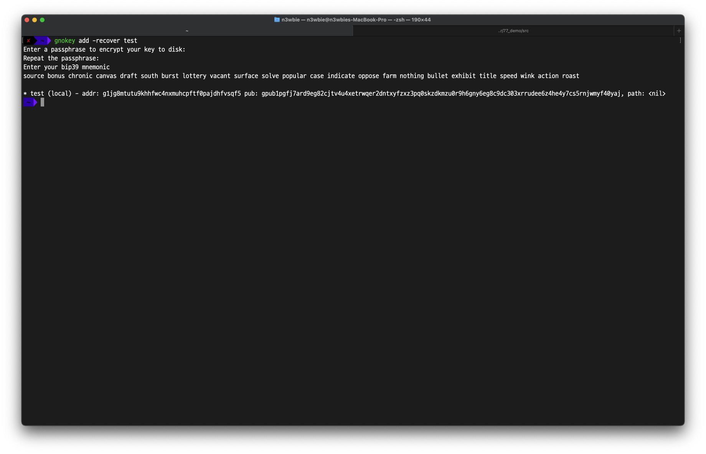<figcaption></figcaption></figure>

Once you import the account, check its balance using the following command:

```bash
$ gnokey query "auth/accounts/{account_address}"
```

<figure>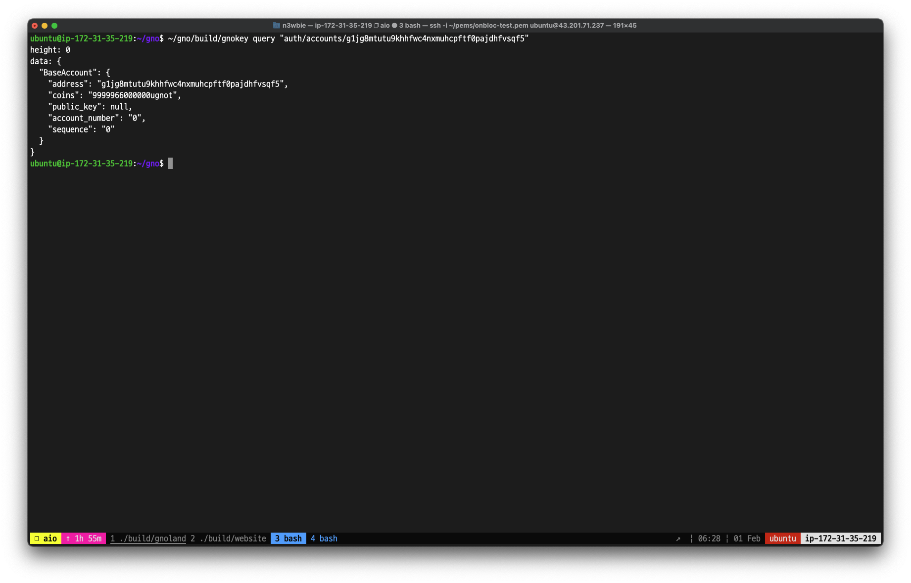<figcaption></figcaption></figure>

#### Step 3. Deploy on Your Local Network

Deploy the realm on your local network with the following command:

```bash
gnokey maketx addpkg test \
--deposit "1ugnot" \
--gas-fee "1ugnot" \
--gas-wanted "5000000" \
--broadcast "true" \
--pkgdir "." \ 
--pkgpath "gno.land/r/demo/tutorial_test"
```

> Note: `test` above is the account name we used for the recovered account, `--pkgdir` is where the contract to deploy is locally (in our case `~/demo` where the above code assumes the terminal is executing from), `--pkgpath` is the deploy to location.

<figure>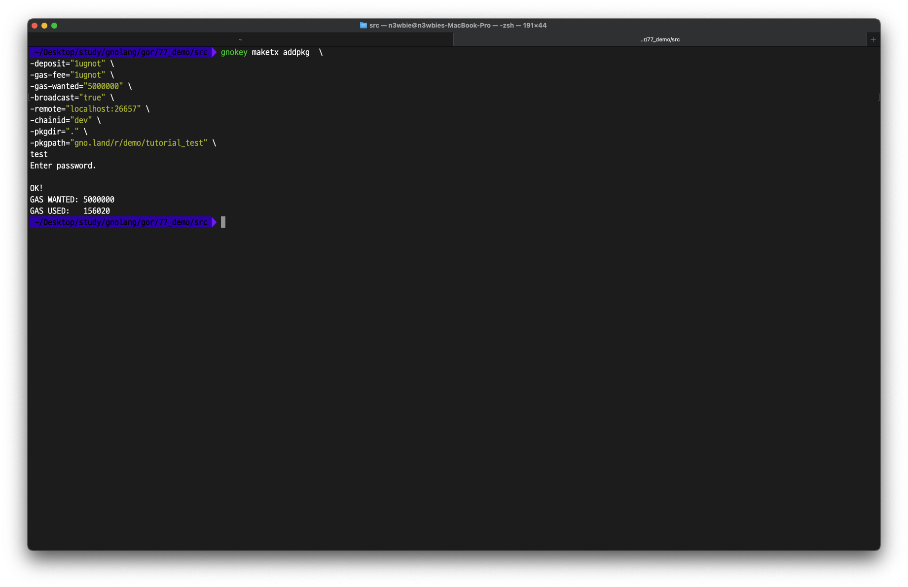<figcaption></figcaption></figure>

Once you successfully deploy the realm, visit `localhost:8888/{pkgpath}?help` on your browser which will display the schemas and a parameter input UI that writes the command for your function.

<figure>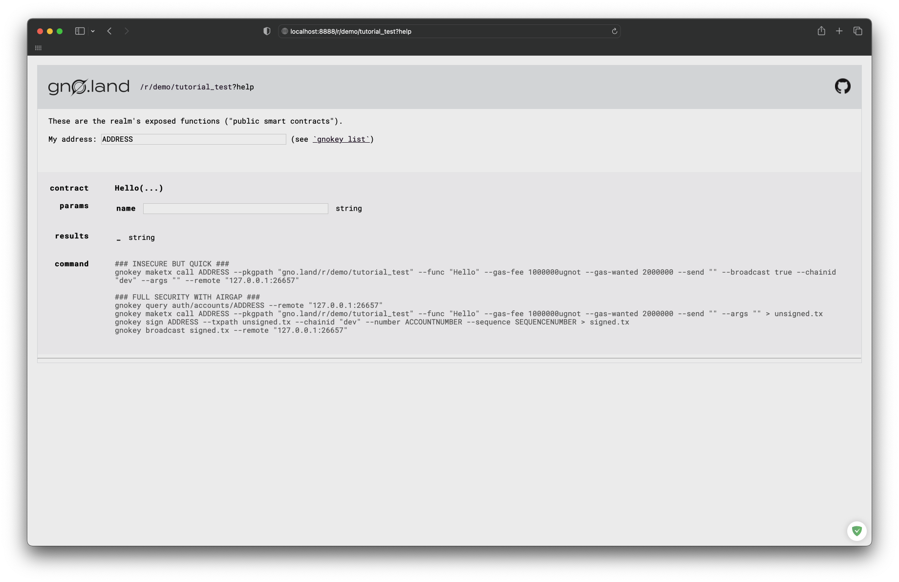<figcaption></figcaption></figure>

### Calling Your Function

There are two ways to call your deployed function using `gnokey`.

#### Method 1. `gnokey make tx call`

This method will execute a transaction to call a function in a realm. Note that this method is used for state-changing functions as it consumes gas.

<figure>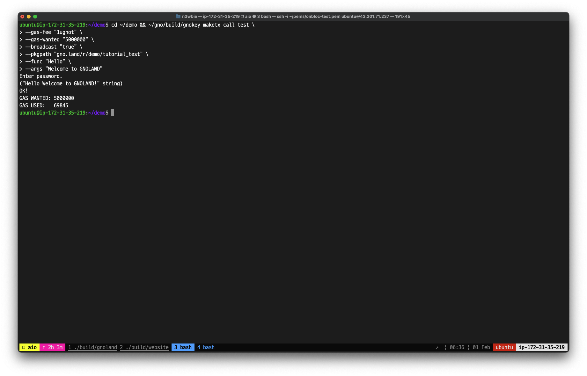<figcaption></figcaption></figure>

#### Method 2. `gnokey query`

This method is only for viewing the state. Use this method for calling non-state-changing functions, as it does not consume any gas.

<figure>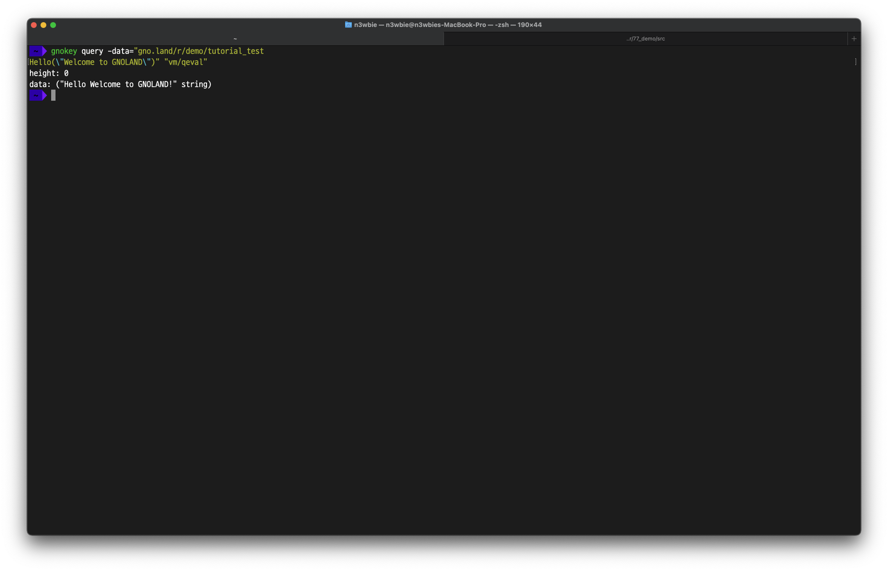<figcaption></figcaption></figure>

## Deploying on the Testnet

You may use your existing account on the Testnet, but you will need to fund it with Testnet GNOTs to pay for transaction fees for deploying and calling realms. We recommend you add a new account to interact with the faucet to receive Testnet GNOTs.

#### Step 1. Create a new Account and Check the Balance

Create a new account with the following command:

```bash
$ gnokey add {account_name} # creates an address with a new seed phrase
$ gnokey add {account_name} --recover --index {index} # creates an address using the existing seed phrase
```

Then, check its balances on the testnet with the following command:

```bash
$ gnokey query bank/balances/{your_address} --remote "http://test3.gno.land:36657"
```

<figure>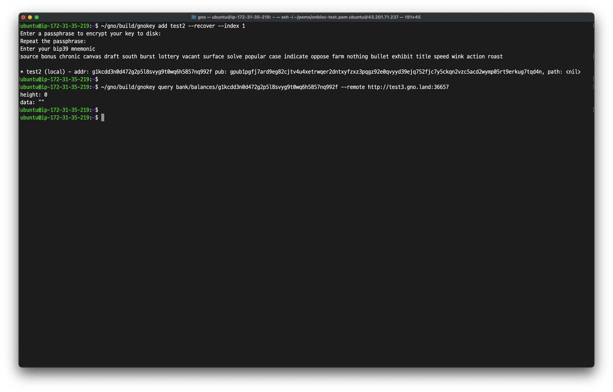<figcaption></figcaption></figure>

#### Step 2. Receive Testnet GNOTs from the Faucet

We're going to use a faucet developed by a community member that you may interact with on this [website](https://app.gno.tools/faucet).

<figure>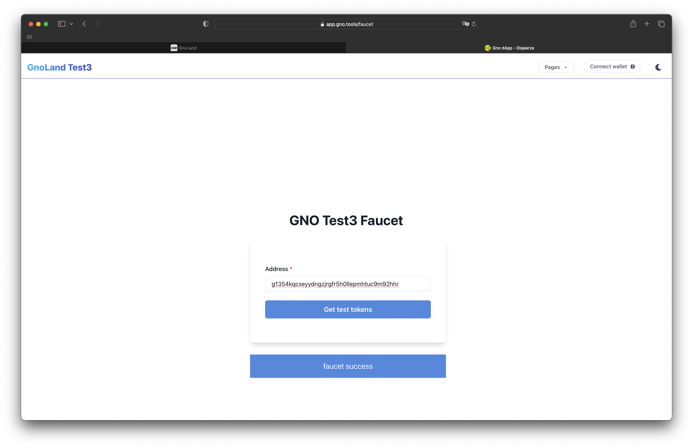<figcaption></figcaption></figure>

Copy and paste your wallet address in the **Address** field and click on **Get test tokens** to receive some Testnet GNOTs.

#### Step 3. Check Your New Balance

Confirm that your wallet has received Testnet GNOTs with the following command:

```bash
$ gnokey query bank/balances/{your_address} --remote http://test3.gno.land:36657
```

<figure>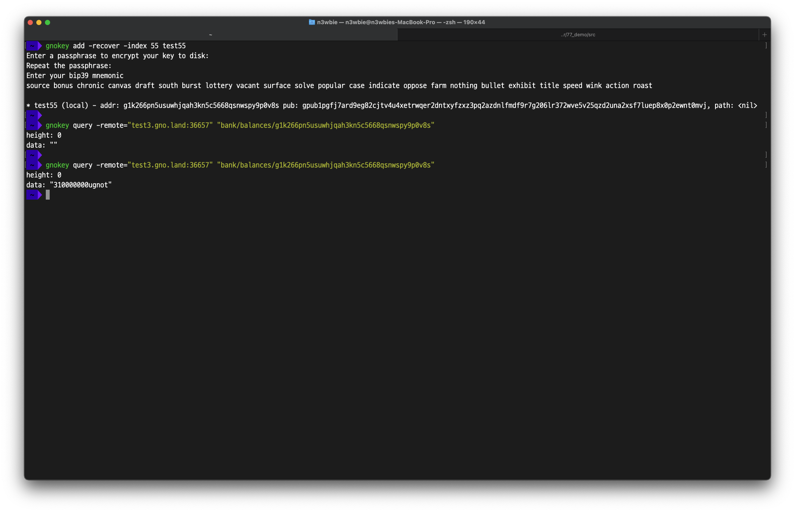<figcaption></figcaption></figure>

We can see that you now have 310 Testnet GNOTS in your wallet.

#### Step 4. Deploy Your Realm on the Testnet

We're going to be using the same commands that we used to deploy our realm in a local environment. However, we need to configure two options to set our target network to the Testnet.&#x20;

* `remote` => `"http://test3.gno.land:36657"`
* `chainid` => `"test3"`

<figure>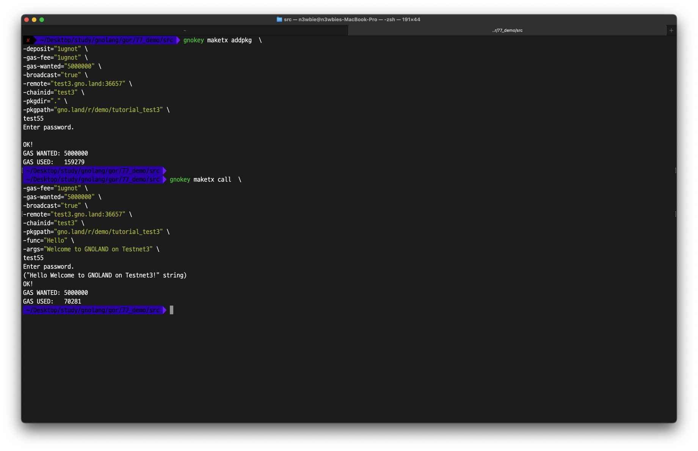<figcaption></figcaption></figure>

#### Step 5. [Check on Gnoscan](https://gnoscan.io/accounts/g1354kqcxeyydngzjrgfr5h0llepmhtuc9m92hhr)

Confirm that your realm has been published by checking your transaction history on Testnet 3 on [Gnoscan](https://gnoscan.io/).

<figure>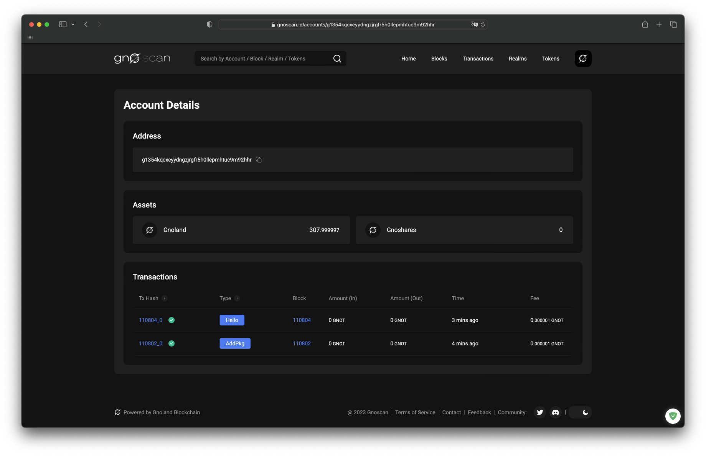<figcaption></figcaption></figure>
